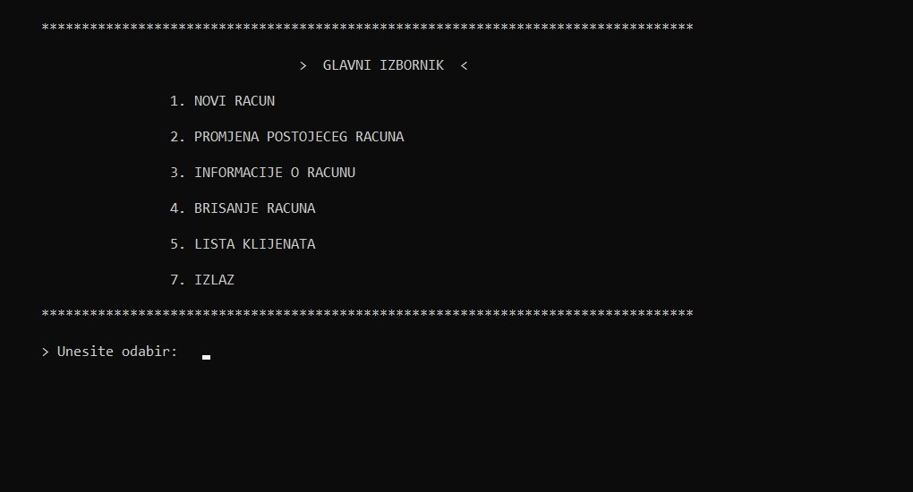
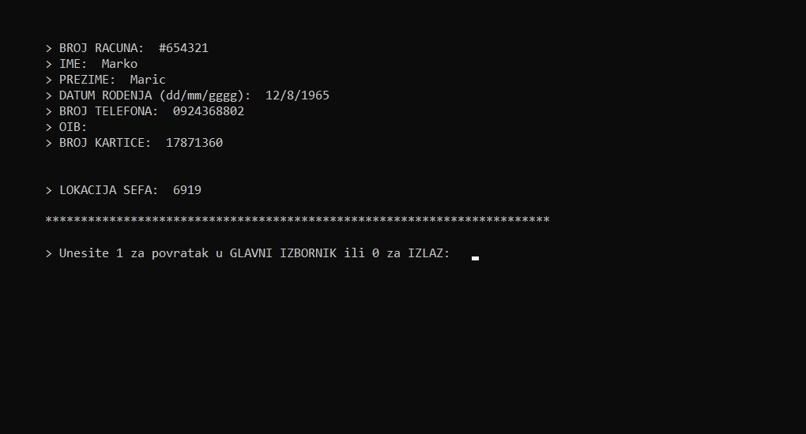

<h1 align="center">Management System</h1>
<h3 align="center">Client management system made in C programming language</h3>

<h3 align="center">✔️ Finished</h3>

## Tech and tools used

## Show your support
Give a ⭐️ if this project helped you!
